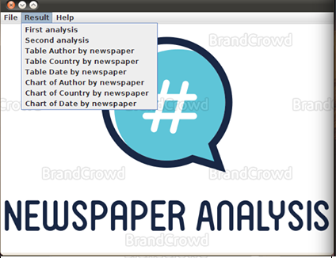
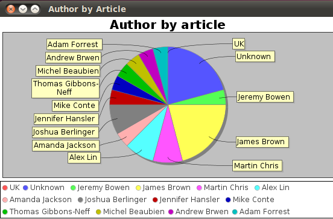
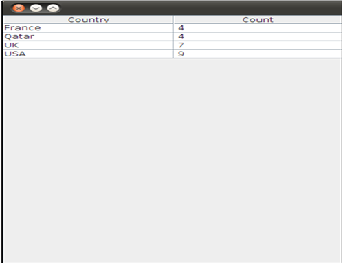
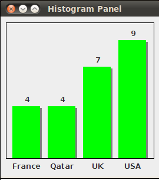
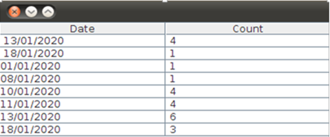

# Newspaper-analysis

To test this project try to execute View/Menu.java :)

This is the GUI of this application
 
Key words
<ul>
  <li>Hadoop</li>
  <li>Java Swing</li>
  <li>HDFS</li>
  <li>BI</li>
  <li>JAR File</li>
 </ul>
 

    
    
    
    
    
    
    
    
    
    

Made by  
<ul>
  <li>Habib AROUA</li>
  <li>Anas NAJJAR</li>
  <li>Imen TRABELSI</li>
  <li>Manel TRABELSI</li>
</ul>ngggfcvv
